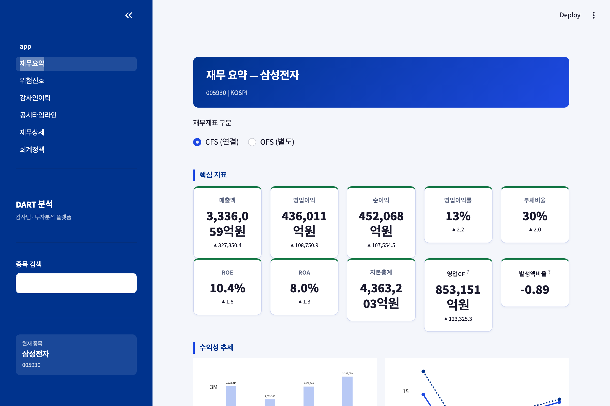
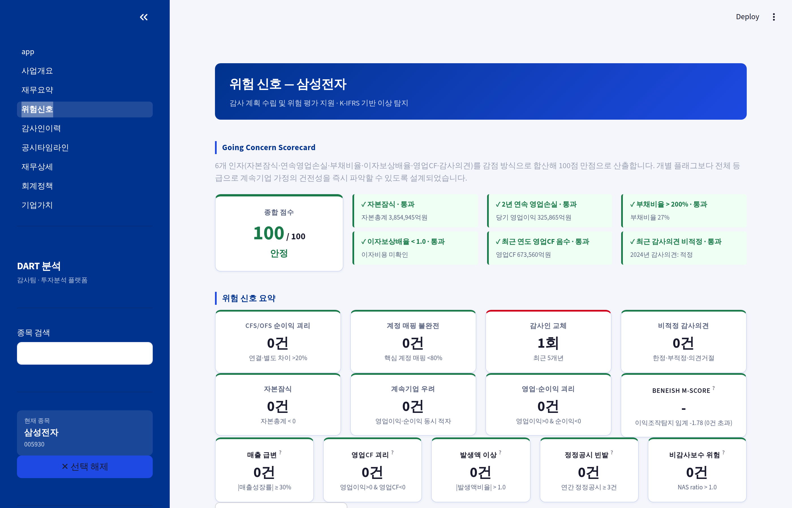
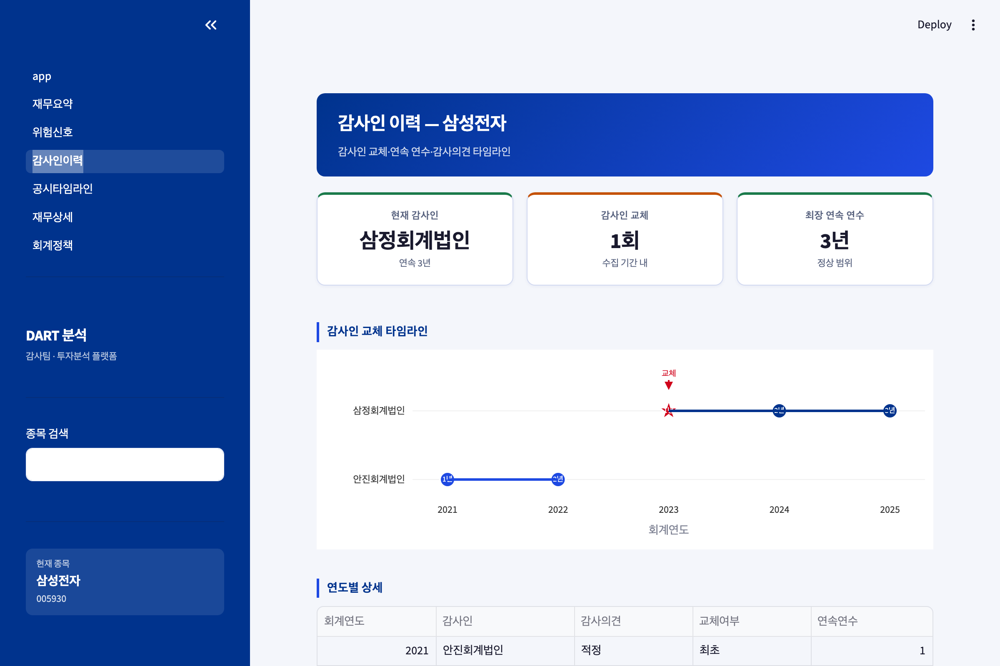
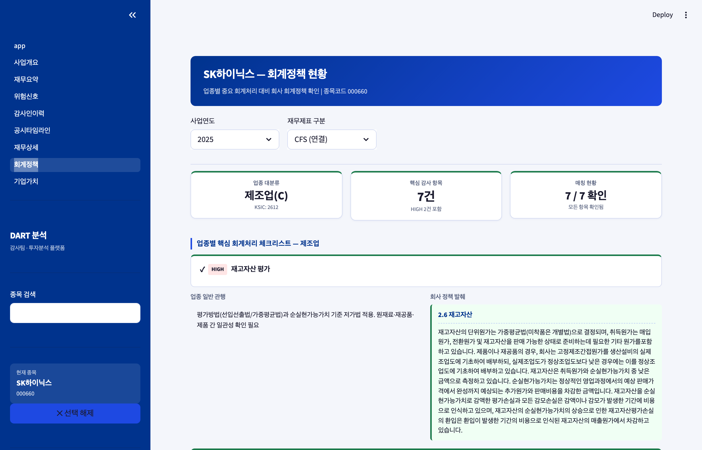

# KReports

**Korean Financial Intelligence MCP**

> DART를 매년 수작업으로 뒤지던 Big4 감사인이 만든 재무 인텔리전스 MCP 서버.
> An MCP server for Korean financial intelligence, built by a Big4 auditor who got tired of manual DART lookups.

[](https://www.python.org/downloads/)
[](https://opensource.org/licenses/Apache-2.0)
[](https://modelcontextprotocol.io)

---

## What is KReports?

KReports connects [DART](https://dart.fss.or.kr) (Korea's SEC filing system) to Claude via the [MCP protocol](https://modelcontextprotocol.io), turning Korean public company filings into actionable financial intelligence.

KReports는 한국 금융감독원 [DART](https://dart.fss.or.kr) 공시 데이터를 [MCP 프로토콜](https://modelcontextprotocol.io)로 Claude에 연결하여 감사인과 투자자를 위한 재무 분석 도구를 제공합니다.

**4 ways to use / 4가지 사용 방법:**
- **MCP Server**: Connect to Claude Desktop / Claude Code for natural language financial analysis
- **CLI**: Collect and analyze data from your terminal
- **Python API**: `import kreports` for programmatic access
- **Dashboard**: Streamlit-based visual analytics (optional)

### Features / 핵심 기능

| Feature | Auditor | Investor | Description |
|---------|:-------:|:--------:|-------------|
| Financial Snapshot / 재무 스냅샷 | O | O | Revenue, operating profit, FCF, ROIC, CCC by year |
| Industry Benchmarking / 업종 벤치마킹 | O | O | KSIC industry P25/P50/P75 distribution + box plot |
| Going Concern Score / 계속기업 스코어 | O | O | 6-factor 100-point deduction scorecard |
| Restatement Detection / 소급 재작성 감지 | O | - | Auto-detect prior period error between annual reports |
| Accounting Policy / 회계정책 추출 | O | - | 15 standard item_keys + year-over-year change tracking |
| Auditor History / 감사인 이력 | O | O | Change, opinion, consecutive years timeline |
| Subsidiary Auditors / 종속회사 감사인 | O | - | Group audit matrix (slim mode for large groups) |
| Beneish M-Score | O | O | Earnings manipulation probability score |

---

## Quick Start

### 1. Install / 설치

```bash
pip install kreports
```

Or from source / 소스에서 설치:

```bash
git clone https://github.com/capitalparser/kreports.git
cd kreports
pip install -e .
```

### 2. DART API Key / API 키 설정

Get your free API key from [DART OpenAPI](https://opendart.fss.or.kr) (takes 1 minute).

[DART OpenAPI](https://opendart.fss.or.kr)에서 무료 API 키를 발급받으세요 (1분 소요).

```bash
echo "DART_API_KEY=your_api_key_here" > .env
```

### 3. Initial Data Collection / 초기 데이터 수집

```bash
# Initialize DB + sync listed companies
# DB 초기화 + 상장사 목록 동기화
kreports init
kreports sync-companies
kreports enrich-market

# Collect core companies (~20 min, 350 companies Q4)
# 핵심 기업 재무데이터 수집 (~20분, 350사 Q4)
kreports collect-seed --size small
```

### 4. Use / 사용

**MCP Server (Claude Desktop / Claude Code):**
```bash
kreports serve
```

**Python API:**
```python
import kreports

# Samsung financial snapshot
snap = kreports.get_financial_snapshot("005930", years=3)

# Going concern risk score
gc = kreports.score_going_concern("005930")
print(f"Score: {gc['score']}/100 ({gc['grade']})")

# Industry benchmark
bench = kreports.get_industry_aggregates("264", metric="영업이익률")
print(f"Median: {bench['quantiles']['p50']}%")
print(f"Industry: {bench['industry_name']}")
```

**Dashboard (optional):**
```bash
pip install kreports[dashboard]
streamlit run dashboard/app.py
```

---

## Claude Desktop Setup / Claude Desktop 연결

Add to `~/.claude/claude_desktop_config.json`:

```json
{
  "mcpServers": {
    "kreports": {
      "command": "kreports",
      "args": ["serve"],
      "env": {
        "DART_API_KEY": "your_api_key_here"
      }
    }
  }
}
```

Then ask Claude / Claude에게 이렇게 물어보세요:

> "Show me Samsung Electronics' financial snapshot for the last 3 years"
> "삼성전자의 계속기업 위험 스코어 확인해줘"
> "Compare SK Hynix operating margin to industry peers"

---

## MCP Tools (8)

| Tool | Input | Description |
|------|-------|-------------|
| `search_company` | query | Search DART-registered listed companies by name or stock code |
| `get_financial_snapshot` | company, years | Annual financials + capital allocation metrics (FCF, ROIC, CCC) |
| `score_going_concern` | company | 6-factor going concern scorecard (100-point deduction) |
| `detect_restatement` | company, threshold | Detect prior period restatements between annual reports |
| `get_accounting_policy` | company, year | Extract 15 standard accounting policy items from footnotes |
| `get_audit_history` | company | Auditor name, opinion, change, consecutive years by year |
| `get_subsidiary_auditors` | company | Subsidiary/associate auditor matrix with slim mode |
| `compare_to_industry` | company, metric | KSIC industry benchmarking with P25/P50/P75 + percentile |

All tools accept company name, stock code (6-digit), or corp_code (8-digit DART ID).

모든 도구는 회사명, 종목코드(6자리), corp_code(8자리) 중 아무거나 입력 가능합니다.

---

## Screenshots / 대시보드 스크린샷

### Financial Summary / 재무 요약


### Industry Benchmarking / 업종 벤치마킹


### Risk Signals (Going Concern Scorecard) / 위험 신호


### Auditor History / 감사인 이력


### Accounting Policy / 회계정책 현황


---

## Data Update Schedule / 데이터 업데이트 주기

DART filings follow a predictable schedule. KReports includes a built-in scheduler for automated updates.

DART 공시는 예측 가능한 일정을 따릅니다. KReports는 자동 업데이트를 위한 스케줄러를 내장하고 있습니다.

### DART Filing Calendar / DART 공시 캘린더

| Period | Report Type | DART Deadline | Recommended Collection |
|--------|------------|---------------|----------------------|
| FY (Q4) | 사업보고서 Annual Report | T+90 days (Mar) | **April** — `kreports collect-seed` |
| Q1 | 분기보고서 Quarterly | T+45 days (May) | June |
| H1 (Q2) | 반기보고서 Semi-annual | T+45 days (Aug) | September |
| Q3 | 분기보고서 Quarterly | T+45 days (Nov) | December |

### Recommended Update Cadence / 권장 업데이트 주기

```
일별 (Daily)     — kreports schedule-start
                    또는 수동: kreports collect-disclosures
                    공시 모니터링 (신규 공시, 주요사항보고)

분기별 (Quarterly) — kreports collect-seed --size small
                    핵심 기업 재무 갱신 (350사 Q4, ~20분)

연 1회 (Annual)   — kreports collect-seed --size full
                    전체 상장사 재무 갱신 (3,951사, ~11시간)
                    kreports collect-auditors
                    감사인·의견 이력 갱신
                    kreports collect-policies <종목코드>
                    회계정책 영속화
```

### Built-in Scheduler / 내장 스케줄러

```bash
# Start background scheduler (APScheduler)
kreports schedule-start
```

| Time (KST) | Job | Description |
|-------------|-----|-------------|
| 07:00 | Disclosure sync | Collect yesterday's new filings for all listed companies |
| 07:30 | Retry failures | Re-attempt failed financial data collections |
| 08:00 | Flag computation | Recalculate risk flags for recently collected companies |

### Data Freshness Indicators / 데이터 최신성

The dashboard and MCP responses include data freshness info:
- **Industry benchmarking**: Shows `coverage_pct` (e.g., "16/494 companies, 3.2%") and `year`
- **Financial snapshot**: Shows `fetched_at` timestamp per record
- **Sparse data warning**: When peer count < 10, suggests running `kreports collect-seed`

---

## CLI Commands / CLI 명령어

```
kreports init                 # Initialize DB / DB 초기화
kreports serve                # Start MCP stdio server / MCP 서버 실행
kreports sync-companies       # Sync listed company registry / 상장사 동기화
kreports enrich-market        # Enrich market + industry codes / 시장·업종코드 보완
kreports collect-seed         # Auto-collect core companies / 핵심 기업 자동 수집
kreports collect <stock>      # Collect single company / 단일 종목 수집
kreports collect-all          # Batch collect all companies / 전체 배치 수집
kreports collect-disclosures  # Collect filings / 공시 수집
kreports collect-auditors     # Collect auditor history / 감사인 이력 수집
kreports collect-audit-fees   # Collect audit fees / 감사보수 수집
kreports collect-policies     # Persist accounting policies / 회계정책 영속화
kreports compute-flags        # Recompute risk flags / 플래그 재계산
kreports show <stock>         # Show financial metrics / 재무지표 조회
kreports schedule-start       # Start daily scheduler / 스케줄러 실행
```

---

## Architecture / 아키텍처

```
kreports/                   # pip package
├── analysis/               # Public API (dict returns, JSON-safe)
│   ├── api.py              # 10 analysis functions
│   └── queries.py          # DB query layer (no Streamlit dependency)
├── mcp/                    # MCP stdio server (8 tools)
├── cli/                    # Typer CLI (17 commands)
├── db/                     # SQLAlchemy models (8 tables)
├── collector/              # DART API collectors (9 modules)
├── processor/              # XBRL/XML parsers (8 modules)
└── judge/                  # Risk flag engine (Beneish, Going Concern)
```

### Database / 데이터베이스

SQLite (`kreports.db`), no external DB required. Tables:

| Table | Records | Purpose |
|-------|--------:|---------|
| companies | 3,951 | Listed company master (corp_code, induty_code) |
| financials | 786 | 6-metric summary + risk flags + Beneish |
| financial_facts | 99,425 | Full XBRL accounts (detailed) |
| disclosures | 5,536 | Filing list |
| auditors | 173 | Auditor history |
| audit_fees | - | Audit fees (DS002) |
| accounting_policy_items | 38 | Persisted policy items with body_hash |
| fetch_log | 873 | Collection history |

### Cache / 캐시

- `.cache/corp_code.zip` — DART company registry XML (TTL: 30 days, auto-refresh)
- Financial data is cached in SQLite (no Redis required)
- `_already_collected()` skips duplicate API calls for existing records

---

## Benchmarking Metrics / 벤치마킹 지표 (8)

| Metric | Unit | Category |
|--------|------|----------|
| 영업이익률 (Operating Margin) | % | Profitability |
| 순이익률 (Net Margin) | % | Profitability |
| ROE | % | Profitability |
| ROA | % | Profitability |
| 부채비율 (Debt Ratio) | % | Stability |
| 자기자본비율 (Equity Ratio) | % | Stability |
| 매출성장률 (Revenue Growth YoY) | % | Growth |
| Beneish M-Score | score | Manipulation risk |

Industry matching uses KSIC codes: 2-digit (major category) or 3-digit (mid category).

업종 매칭은 KSIC 코드 2자리(대분류) 또는 3자리(중분류) 사용.

---

## Going Concern Scorecard / 계속기업 스코어카드

100-point deduction system / 100점 감점 방식:

| Factor | Deduction | Threshold |
|--------|----------:|-----------|
| Capital impairment / 자본잠식 | -30 | Total equity < 0 |
| 2-year consecutive operating loss / 2년 연속 영업손실 | -20 | Operating profit < 0 for 2 years |
| Debt ratio > 200% / 부채비율 > 200% | -15 | Debt / Equity > 200% |
| Interest coverage < 1.0 / 이자보상배율 < 1.0 | -15 | Operating profit / Interest expense < 1 |
| Negative operating CF / 영업CF 음수 | -10 | Operating cash flow < 0 |
| Non-clean audit opinion / 비적정 감사의견 | -10 | Qualified / Adverse / Disclaimer |

Grades: Stable (80+) / Caution (60-79) / Warning (40-59) / Danger (<40)

등급: 안정(80+) / 주의(60-79) / 경고(40-59) / 위험(<40)

---

## Data Collection Strategy / 데이터 수집 전략

```bash
kreports collect-seed --size small     # KOSPI200+KOSDAQ150, ~20 min
kreports collect-seed --size medium    # KOSPI full, ~50 min
kreports collect-seed --size full      # All listed, ~11 hours
```

- **Q4 priority**: Benchmarking uses annual (Q4) data. `--annual-only` enabled by default.
- **Industry diversity**: Round-robin selection by KSIC 2-digit prefix. At least 1 company per industry.
- **Deduplication**: Already-collected company-year-quarter combos are auto-skipped.
- **DART API limit**: 10,000 calls/day. `collect-seed small` uses ~1,050 calls.

---

## Requirements / 요구 사항

- Python 3.11+
- DART OpenAPI key ([free registration](https://opendart.fss.or.kr))

---

## License / 라이선스

Apache License 2.0. Free to use, modify, and distribute.

---

## Contributing / 기여

Issues and pull requests are welcome. 이슈 리포트와 풀 리퀘스트를 환영합니다.

---

## Author / 만든 사람

**capitalparser** — Big4 accounting firm, 7-year CPA. Built to automate the annual DART manual labor from audit fieldwork.

Big4 회계법인 7년차 공인회계사. 감사 현장에서 매년 반복하던 DART 수작업을 자동화하기 위해 만들었습니다.
