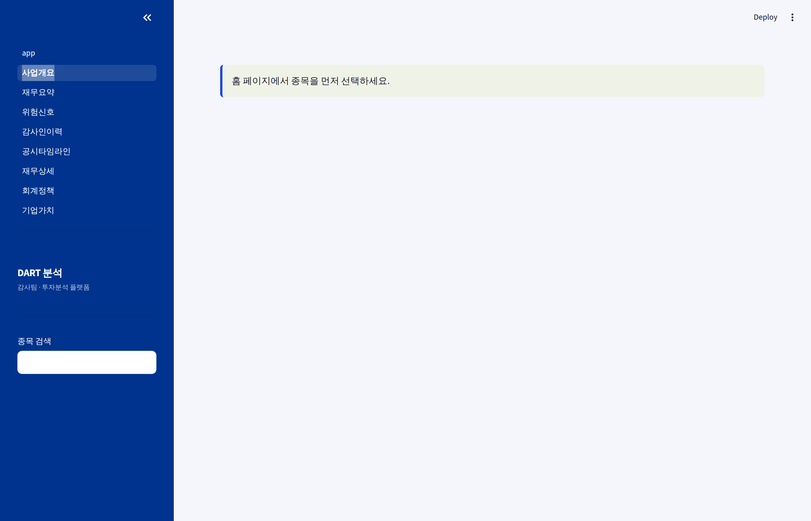
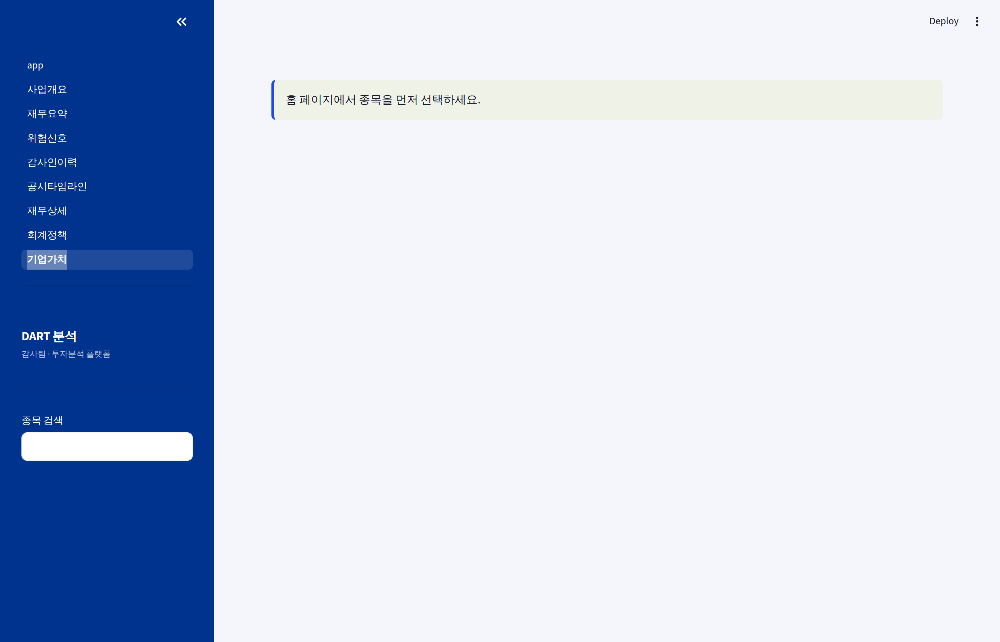

# KReports

**Korean Financial Intelligence MCP**

[English](#english) | [한국어](#한국어)

---

<a id="english"></a>

## English

> An MCP server for Korean financial intelligence, built by a Big4 auditor who got tired of manual DART lookups.

[](https://www.python.org/downloads/)
[](https://opensource.org/licenses/Apache-2.0)
[](https://modelcontextprotocol.io)

### What is KReports?

KReports connects [DART](https://dart.fss.or.kr) (Korea's SEC filing system) to Claude via the [MCP protocol](https://modelcontextprotocol.io), turning Korean public company filings into actionable financial intelligence.

**4 ways to use:**
- **MCP Server** — Connect to Claude Desktop / Claude Code for natural language financial analysis
- **CLI** — Collect and analyze data from your terminal
- **Python API** — `import kreports` for programmatic access
- **Dashboard** — Streamlit-based visual analytics (optional)

### Features

| Feature | Auditor | Investor | Description |
|---------|:-------:|:--------:|-------------|
| Financial Snapshot | O | O | Revenue, operating profit, FCF, ROIC, CCC by year |
| Industry Benchmarking | O | O | KSIC industry P25/P50/P75 distribution + box plot |
| Going Concern Score | O | O | 6-factor 100-point deduction scorecard |
| Restatement Detection | O | - | Auto-detect prior period error between annual reports |
| Accounting Policy | O | - | 15 standard item keys + year-over-year change tracking |
| Auditor History | O | O | Change, opinion, consecutive years timeline |
| Subsidiary Auditors | O | - | Group audit matrix (slim mode for large groups) |
| Beneish M-Score | O | O | Earnings manipulation probability score |
| **Business Report Sections** | **O** | **O** | **Extract key narrative from annual reports (overview, risk, MD&A)** |
| **DCF Valuation Support** | - | **O** | **NOPAT, EBITDA, Unlevered FCF, effective tax rate, NWC delta** |

### Quick Start

```bash
# Install
pip install kreports

# Set DART API key (free: https://opendart.fss.or.kr)
echo "DART_API_KEY=your_key" > .env

# Initialize
kreports init
kreports sync-companies
kreports enrich-market

# Collect core companies (~20 min, 350 companies)
kreports collect-seed --size small

# Start MCP server
kreports serve
```

### Claude Desktop Setup

Add to `~/.claude/claude_desktop_config.json`:

```json
{
  "mcpServers": {
    "kreports": {
      "command": "kreports",
      "args": ["serve"],
      "env": { "DART_API_KEY": "your_key" }
    }
  }
}
```

Then ask Claude:

> "Show me Samsung Electronics' financial snapshot for the last 3 years"
> "Check SK Hynix going concern risk score"
> "Compare Samsung's operating margin to semiconductor industry peers"

### Python API

```python
import kreports

# Financial snapshot (unit: 억원 = 100M KRW)
snap = kreports.get_financial_snapshot("005930", years=3)

# Going concern score
gc = kreports.score_going_concern("005930")
print(f"Score: {gc['score']}/100 ({gc['grade']})")

# Industry benchmark
bench = kreports.get_industry_aggregates("264", metric="영업이익률")
print(f"Industry: {bench['industry_name']}")
print(f"Median: {bench['quantiles']['p50']}%")
```

### MCP Tools (8)

| Tool | Input | Description |
|------|-------|-------------|
| `search_company` | query | Search listed companies by name or stock code |
| `get_financial_snapshot` | company, years | Annual financials + capital allocation (FCF, ROIC, CCC) |
| `score_going_concern` | company | 6-factor going concern scorecard |
| `detect_restatement` | company, threshold | Detect prior period restatements |
| `get_accounting_policy` | company, year | Extract 15 accounting policy items from footnotes |
| `get_audit_history` | company | Auditor name, opinion, change, consecutive years |
| `get_subsidiary_auditors` | company | Subsidiary/associate auditor matrix |
| `compare_to_industry` | company, metric | KSIC industry benchmarking (P25/P50/P75) |

All tools accept company name, stock code (6-digit), or corp_code (8-digit DART ID).

### Data Update Schedule

DART filings follow a predictable schedule. KReports includes a built-in scheduler.

**DART Filing Calendar:**

| Period | Report | Deadline | Recommended Collection |
|--------|--------|----------|----------------------|
| FY (Q4) | Annual Report | T+90 days (Mar) | **April** |
| Q1 | Quarterly | T+45 days (May) | June |
| H1 (Q2) | Semi-annual | T+45 days (Aug) | September |
| Q3 | Quarterly | T+45 days (Nov) | December |

**Recommended Cadence:**

| Frequency | Command | Purpose |
|-----------|---------|---------|
| Daily | `kreports schedule-start` | Disclosure monitoring (07:00 KST) |
| Quarterly | `kreports collect-seed --size small` | Core company financial refresh (~20 min) |
| Annually | `kreports collect-seed --size full` | Full listed company refresh (~11 hours) |

**Built-in Scheduler (APScheduler):**

| Time (KST) | Job | Description |
|-------------|-----|-------------|
| 07:00 | Disclosure sync | Collect yesterday's new filings |
| 07:30 | Retry failures | Re-attempt failed collections |
| 08:00 | Flag computation | Recalculate risk flags |

### Data Collection Strategy

```bash
kreports collect-seed --size small     # KOSPI200+KOSDAQ150, ~20 min
kreports collect-seed --size medium    # KOSPI full, ~50 min
kreports collect-seed --size full      # All listed companies, ~11 hours
```

- **Q4 priority**: Benchmarking uses annual data. `--annual-only` enabled by default.
- **Industry diversity**: Round-robin by KSIC 2-digit prefix.
- **Deduplication**: Already-collected records are auto-skipped.
- **DART API limit**: 10,000 calls/day. `collect-seed small` uses ~1,050.

### Going Concern Scorecard

100-point deduction system:

| Factor | Deduction | Threshold |
|--------|----------:|-----------|
| Capital impairment | -30 | Total equity < 0 |
| 2-year operating loss | -20 | Operating profit < 0 for 2 consecutive years |
| Debt ratio > 200% | -15 | Debt / Equity > 200% |
| Interest coverage < 1.0 | -15 | Operating profit / Interest expense < 1 |
| Negative operating CF | -10 | Operating cash flow < 0 |
| Non-clean audit opinion | -10 | Qualified / Adverse / Disclaimer |

Grades: Stable (80+) / Caution (60-79) / Warning (40-59) / Danger (<40)

### Benchmarking Metrics (8)

| Metric | Unit | Category |
|--------|------|----------|
| Operating Margin | % | Profitability |
| Net Margin | % | Profitability |
| ROE | % | Profitability |
| ROA | % | Profitability |
| Debt Ratio | % | Stability |
| Equity Ratio | % | Stability |
| Revenue Growth YoY | % | Growth |
| Beneish M-Score | score | Manipulation risk |

### Architecture

```
kreports/                   # pip package
├── analysis/               # Public API (dict returns, JSON-safe)
│   ├── api.py              # 10 analysis functions
│   └── queries.py          # DB query layer (no Streamlit dependency)
├── mcp/                    # MCP stdio server (8 tools)
├── cli/                    # Typer CLI (17 commands)
├── db/                     # SQLAlchemy models (8 tables)
├── collector/              # DART API collectors (9 modules)
├── processor/              # XBRL/XML parsers (9 modules)
│   └── report_section_parser.py  # Business report narrative extraction
└── judge/                  # Risk flag engine (Beneish, Going Concern)

dashboard/                  # Streamlit analytics UI (9 pages)
├── app.py                  # Home + company search
├── sidebar.py              # Shared sidebar (search, CFS/OFS, recent stocks)
├── pages/
│   ├── 0_사업개요.py        # Business report key sections
│   ├── 1_재무요약.py        # Financial summary + KPIs
│   ├── 2_위험신호.py        # Risk signals + Going Concern
│   ├── 3_감사인이력.py      # Auditor history + subsidiary auditors
│   ├── 4_공시타임라인.py    # Disclosure timeline
│   ├── 5_재무상세.py        # XBRL account explorer
│   ├── 6_회계정책.py        # Accounting policy checklist
│   └── 7_기업가치.py        # DCF valuation support
└── db.py                   # Query layer with Streamlit caching
```

Database: SQLite (`kreports.db`), no external DB required.

### CLI Commands

```
kreports init                 # Initialize DB
kreports serve                # Start MCP server
kreports sync-companies       # Sync company registry
kreports enrich-market        # Enrich market + industry codes
kreports collect-seed         # Auto-collect core companies
kreports collect <stock>      # Collect single company
kreports collect-all          # Batch collect all companies
kreports collect-disclosures  # Collect filings
kreports collect-auditors     # Collect auditor history
kreports collect-audit-fees   # Collect audit fees
kreports collect-policies     # Persist accounting policies
kreports compute-flags        # Recompute risk flags
kreports show <stock>         # Show financial metrics
kreports schedule-start       # Start daily scheduler
```

### Dashboard (9 Pages)

| # | Page | Description |
|---|------|-------------|
| 0 | Business Overview | Key narrative sections from annual reports (overview, risk, MD&A) |
| 1 | Financial Summary | KPIs, profitability/health charts, industry benchmarking |
| 2 | Risk Signals | Going concern scorecard, anomaly detection, Beneish M-Score |
| 3 | Auditor History | Auditor timeline, fee history, subsidiary audit matrix |
| 4 | Disclosure Timeline | DART filing calendar with audit-related filtering |
| 5 | Financial Details | Full XBRL account explorer with footnote lookup |
| 6 | Accounting Policy | Industry checklist, year-over-year policy change tracking |
| 7 | Enterprise Valuation | DCF inputs: NOPAT, EBITDA, Unlevered FCF, waterfall chart, CSV export |

**UX Features:** CFS/OFS sync across pages, recently viewed stocks, data freshness display, CSV export, loading spinners, smart empty-state messages.

### Screenshots

#### Business Overview (NEW)


#### Financial Summary


#### Industry Benchmarking


#### Risk Signals


#### Auditor History


#### Accounting Policy


#### Enterprise Valuation — DCF (NEW)


### Requirements

- Python 3.11+
- DART OpenAPI key ([free registration](https://opendart.fss.or.kr))

### License

Apache License 2.0

### Author

**capitalparser** — Big4 accounting firm, 7-year CPA. Built to automate the annual DART manual labor from audit fieldwork.

---

<a id="한국어"></a>

## 한국어

> DART를 매년 수작업으로 뒤지던 Big4 감사인이 만든 재무 인텔리전스 MCP 서버.

### KReports란?

KReports는 한국 금융감독원 [DART](https://dart.fss.or.kr) 공시 데이터를 [MCP 프로토콜](https://modelcontextprotocol.io)로 Claude에 연결하여 감사인과 투자자를 위한 재무 분석 도구를 제공합니다.

**4가지 사용 방법:**
- **MCP 서버** — Claude Desktop / Claude Code에 연결하여 자연어로 재무 분석
- **CLI** — 터미널에서 데이터 수집 + 분석
- **Python API** — `import kreports`로 프로그래밍 방식 사용
- **대시보드** — Streamlit 기반 시각적 분석 (선택 사항)

### 핵심 기능

| 기능 | 감사인 | 투자자 | 설명 |
|------|:------:|:------:|------|
| 재무 스냅샷 | O | O | 매출·영업이익·FCF·ROIC·CCC 연도별 추세 |
| 업종 벤치마킹 | O | O | KSIC 업종 내 P25/P50/P75 분포 + 박스플롯 |
| 계속기업 스코어 | O | O | 6인자 100점 감점 스코어카드 |
| 소급 재작성 감지 | O | - | 사업보고서 간 전기 금액 변동 자동 탐지 |
| 회계정책 추출 | O | - | 15개 표준 item_key별 주석 발췌 + 연도별 변화 추적 |
| 감사인 이력 | O | O | 교체·의견·연속연수 타임라인 |
| 종속회사 감사인 | O | - | 연결그룹 감사인 매트릭스 |
| Beneish M-Score | O | O | 이익 조작 가능성 지표 |
| **사업보고서 섹션 추출** | **O** | **O** | **사업개요·위험관리·경영계획 등 본문 핵심 섹션 자동 추출** |
| **DCF 평가 지원** | - | **O** | **NOPAT·EBITDA·Unlevered FCF·실효세율·NWC 변동 산출** |

### 빠른 시작

```bash
# 설치
pip install kreports

# DART API 키 설정 (무료: https://opendart.fss.or.kr)
echo "DART_API_KEY=your_key" > .env

# 초기화
kreports init
kreports sync-companies
kreports enrich-market

# 핵심 기업 재무 수집 (~20분, 350사)
kreports collect-seed --size small

# MCP 서버 실행
kreports serve
```

### Claude Desktop 연결

`~/.claude/claude_desktop_config.json`에 추가:

```json
{
  "mcpServers": {
    "kreports": {
      "command": "kreports",
      "args": ["serve"],
      "env": { "DART_API_KEY": "your_key" }
    }
  }
}
```

연결 후 Claude에게:

> "삼성전자 최근 3년 재무 스냅샷 보여줘"
> "SK하이닉스 계속기업 위험 스코어 확인해줘"
> "삼성전자와 동종업종 영업이익률 비교해줘"

### Python API

```python
import kreports

# 재무 스냅샷 (단위: 억원)
snap = kreports.get_financial_snapshot("005930", years=3)

# 계속기업 스코어
gc = kreports.score_going_concern("005930")
print(f"점수: {gc['score']}/100 ({gc['grade']})")

# 업종 벤치마킹
bench = kreports.get_industry_aggregates("264", metric="영업이익률")
print(f"업종: {bench['industry_name']}")
print(f"중앙값: {bench['quantiles']['p50']}%")
```

### MCP 도구 (8개)

| 도구 | 입력 | 설명 |
|------|------|------|
| `search_company` | 회사명 / 종목코드 | DART 등록 상장사 검색 |
| `get_financial_snapshot` | company, years | 연도별 핵심 재무 + 자본배분 지표 |
| `score_going_concern` | company | 6인자 계속기업 스코어카드 |
| `detect_restatement` | company, threshold | 소급 재작성 감지 |
| `get_accounting_policy` | company, year | 회계정책 15개 항목 추출 |
| `get_audit_history` | company | 감사인·의견·연속연수 이력 |
| `get_subsidiary_auditors` | company | 종속회사 감사인 매트릭스 |
| `compare_to_industry` | company, metric | 동종업종 벤치마킹 (P25/P50/P75) |

모든 도구는 회사명, 종목코드(6자리), corp_code(8자리) 중 아무거나 입력 가능합니다.

### 데이터 업데이트 주기

DART 공시는 예측 가능한 일정을 따릅니다. KReports는 자동 업데이트를 위한 스케줄러를 내장하고 있습니다.

**DART 공시 캘린더:**

| 기간 | 보고서 | 제출기한 | 권장 수집 시점 |
|------|--------|---------|-------------|
| FY (Q4) | 사업보고서 | T+90일 (3월) | **4월** |
| Q1 | 분기보고서 | T+45일 (5월) | 6월 |
| H1 (Q2) | 반기보고서 | T+45일 (8월) | 9월 |
| Q3 | 분기보고서 | T+45일 (11월) | 12월 |

**권장 업데이트 주기:**

| 주기 | 명령 | 용도 |
|------|------|------|
| 일별 | `kreports schedule-start` | 공시 모니터링 (매일 07:00 KST) |
| 분기별 | `kreports collect-seed --size small` | 핵심 기업 재무 갱신 (~20분) |
| 연 1회 | `kreports collect-seed --size full` | 전체 상장사 재무 갱신 (~11시간) |

**내장 스케줄러 (APScheduler):**

| 시각 (KST) | 작업 | 설명 |
|------------|------|------|
| 07:00 | 공시 동기화 | 전일 신규 공시 전체 수집 |
| 07:30 | 실패 재시도 | 수집 실패 건 재시도 |
| 08:00 | 플래그 계산 | 최근 수집 기업 위험 플래그 재계산 |

### 계속기업 스코어카드

100점 감점 방식:

| 인자 | 감점 | 기준 |
|------|------|------|
| 자본잠식 | -30 | 자본총계 < 0 |
| 2년 연속 영업손실 | -20 | 최근 2년 영업이익 < 0 |
| 부채비율 > 200% | -15 | 부채/자본 > 200% |
| 이자보상배율 < 1.0 | -15 | 영업이익/이자비용 < 1 |
| 영업CF 음수 | -10 | 최근 연도 영업활동현금흐름 < 0 |
| 비적정 감사의견 | -10 | 한정/부적정/의견거절 |

등급: 안정(80+) / 주의(60-79) / 경고(40-59) / 위험(<40)

### 벤치마킹 지표 (8개)

| 지표 | 단위 | 분류 |
|------|------|------|
| 영업이익률 | % | 수익성 |
| 순이익률 | % | 수익성 |
| ROE | % | 수익성 |
| ROA | % | 수익성 |
| 부채비율 | % | 안정성 |
| 자기자본비율 | % | 안정성 |
| 매출성장률 | % | 성장성 |
| Beneish M-Score | score | 이상 신호 |

업종 매칭은 KSIC 코드 2자리(대분류) 또는 3자리(중분류) 사용.

### 데이터 수집 전략

```bash
kreports collect-seed --size small     # KOSPI200+KOSDAQ150, ~20분
kreports collect-seed --size medium    # KOSPI 전체, ~50분
kreports collect-seed --size full      # 전체 상장사, ~11시간
```

- **Q4 우선**: 벤치마킹은 연간(Q4) 데이터만 사용. `--annual-only` 기본 활성화.
- **업종 분산**: KSIC 2자리 기준 라운드 로빈 선택.
- **중복 방지**: 이미 수집된 기업-연도-분기는 자동 건너뜀.
- **DART API 제한**: 일 10,000건. `collect-seed small`은 ~1,050건 사용.

### CLI 명령어

```
kreports init                 # DB 초기화
kreports serve                # MCP 서버 실행
kreports sync-companies       # 상장사 목록 동기화
kreports enrich-market        # 시장·업종코드 보완
kreports collect-seed         # 핵심 기업 자동 수집
kreports collect <종목코드>    # 단일 종목 수집
kreports collect-all          # 전체 배치 수집
kreports collect-disclosures  # 공시 수집
kreports collect-auditors     # 감사인 이력 수집
kreports collect-audit-fees   # 감사보수 수집
kreports collect-policies     # 회계정책 영속화
kreports compute-flags        # 플래그 재계산
kreports show <종목코드>       # 재무지표 조회
kreports schedule-start       # 스케줄러 실행
```

### 대시보드 (9개 페이지)

| # | 페이지 | 설명 |
|---|--------|------|
| 0 | 사업 개요 | 사업보고서 본문 핵심 섹션 추출 (사업개요, 위험관리, 경영계획 등) |
| 1 | 재무 요약 | KPI 카드, 수익성/건전성 차트, 업종 벤치마킹 |
| 2 | 위험 신호 | Going Concern 스코어카드, 이상 탐지, Beneish M-Score |
| 3 | 감사인 이력 | 감사인 타임라인, 감사보수, 종속회사 감사인 매트릭스 |
| 4 | 공시 타임라인 | DART 공시 캘린더, 감사 관련 필터링 |
| 5 | 재무 상세 | XBRL 전체 계정 탐색, 주석 조회 |
| 6 | 회계정책 | 업종별 체크리스트, 연도별 정책 변화 추적 |
| 7 | 기업가치 (DCF) | NOPAT, EBITDA, Unlevered FCF, 워터폴 차트, CSV 내보내기 |

**UX 기능:** CFS/OFS 페이지 간 연동, 최근 조회 종목, 데이터 신선도 표시, CSV 내보내기, 로딩 스피너, 데이터 상태 구분 메시지.

### 대시보드 스크린샷

#### 사업 개요 (신규)


#### 재무 요약


#### 업종 벤치마킹


#### 위험 신호


#### 감사인 이력


#### 회계정책 현황


#### 기업가치 — DCF (신규)


### 아키텍처

```
kreports/                   # pip 패키지
├── analysis/               # 공개 API (dict 반환, JSON-safe)
│   ├── api.py              # 10개 분석 함수
│   └── queries.py          # DB 쿼리 레이어 (Streamlit 무의존)
├── mcp/                    # MCP stdio 서버 (8개 도구)
├── cli/                    # Typer CLI (17개 명령)
├── db/                     # SQLAlchemy 모델 (8개 테이블)
├── collector/              # DART API 수집기 (9개 모듈)
├── processor/              # XBRL/XML 파서 (9개 모듈)
│   └── report_section_parser.py  # 사업보고서 본문 섹션 추출
└── judge/                  # 위험 플래그 엔진 (Beneish, Going Concern)

dashboard/                  # Streamlit 분석 대시보드 (9개 페이지)
├── app.py                  # 홈 + 기업 검색
├── sidebar.py              # 공유 사이드바 (검색, CFS/OFS, 최근 조회)
├── pages/                  # 0_사업개요 ~ 7_기업가치
└── db.py                   # 쿼리 레이어 (Streamlit 캐싱)
```

데이터베이스: SQLite (`kreports.db`), 외부 DB 불필요.

### 요구 사항

- Python 3.11+
- DART OpenAPI 키 ([무료 발급](https://opendart.fss.or.kr))

### 라이선스

Apache License 2.0

### 만든 사람

**capitalparser** — Big4 회계법인 7년차 공인회계사. 감사 현장에서 매년 반복하던 DART 수작업을 자동화하기 위해 만들었습니다.
