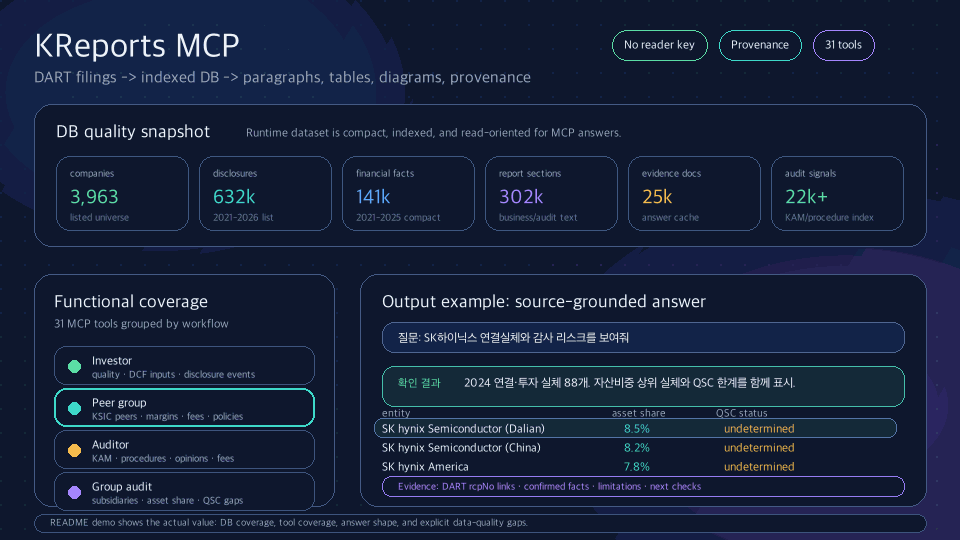

# KReports

**DART 공시를 LLM이 근거와 함께 읽고 비교하도록 만드는 MCP 기반 금융정보 레이어**

[English](#english) · [한국어](#한국어)

[](https://modelcontextprotocol.io)
[](https://www.python.org/)
[](LICENSE)

## Why this MCP exists

### DART API is essential, but it is not an analyst interface

[DART](https://dart.fss.or.kr) is Korea's official disclosure system and its
OpenAPI is the authoritative starting point. The API is primarily authenticated
REST endpoints that return JSON metadata, financial facts, disclosure lists,
and links to ZIP/XML report documents. It is good at retrieving an identified
company, period, or filing, but it does not answer a cross-document question.

In practice, a caller must resolve corp codes and receipt numbers, manage API
keys and limits, download and decode archives, locate the right report section
or note, normalize changing tables, and preserve provenance. DART does not
semantically compare a business report with an audit report, a note with peer
notes, or a filing with a recent disclosure event. Repeating that integration
work in every assistant is why a raw API call is not enough.

### MCP is the missing interaction layer

The [Model Context Protocol (MCP)](https://modelcontextprotocol.io) is an open
protocol for exposing typed tools and contextual resources to an LLM client.
An MCP server publishes discoverable operations with bounded inputs, structured
outputs, and source metadata. The server keeps credentials, retrieval policy,
data boundaries, and evidence linkage under application control while Claude
or another compatible client chooses the appropriate operation.

KReports uses MCP because the useful question is not “call endpoint X”; it is:

> “Compare this company's lease-note policy, right-of-use assets, and lease
> liabilities with a configurable peer group, show the original excerpts, and
> explain what changed.”

That requires multiple DART endpoints and documents, deterministic peer
selection, semantic extraction, and an answer contract that distinguishes
confirmed facts from unavailable or unverified source material. MCP provides one
stable, auditable surface for that workflow.

### What KReports adds to DART

KReports is the document-and-evidence layer between DART and an LLM. It resolves
companies and filings, indexes business and audit report sections, preserves
accounting-note source spans, joins disclosures with financial facts, selects
custom peer cohorts, and returns provenance-aware results. The LLM supplies
natural-language reasoning; KReports supplies bounded retrieval and evidence.

<p align="center">
  
</p>

---

<a id="english"></a>

## English

> Built by a Big4 auditor for investors and audit teams who need to read Korean filings without living inside DART.

### Core capabilities

- **Semantic company context** — combines business-report sections (business
  overview, risks, raw materials, facilities, governance), audit-report
  evidence, disclosures, and financial facts by company and year.
- **Accounting-note comparison** — compares a selected topic such as leases,
  accounting policies, commitments, or contingencies across one company or a
  peer group. Results preserve original excerpts, locators, formatting metadata,
  and source availability states.
- **Custom peer cohorts** — select peers by industry-code prefix, explicit
  company list, or adaptive criteria. The selected cohort and rule are returned
  for reproducibility.
- **Investor signals** — quality of earnings, cash conversion, leverage, DCF
  input candidates, recent disclosure events, and next checks.
- **Audit signals** — going-concern score, restatement candidates, auditor
  history, audit/non-audit fees, group-audit perimeter, KAM topics, and audit
  procedures.
- **Evidence-first answers** — facts, analysis, next checks, and filing
  provenance are separated. Missing, unavailable, or unverified originals are
  never silently presented as confirmed facts.

### MCP tool groups

| Area | Representative tools |
|---|---|
| Company and search | `search_company`, `search_dataset` |
| Investor and valuation | `get_investor_signals`, `get_quality_of_earnings_pack`, `get_dcf_input_candidates` |
| Financial and peers | `get_financial_snapshot`, `compare_to_industry`, `compare_to_industry_multi`, `select_peer_group` |
| Disclosures | `search_disclosure_events`, `fetch_disclosure_on_demand` |
| Audit risk | `score_going_concern`, `detect_restatement`, `build_audit_acceptance_pack`, `estimate_audit_hours_proxy` |
| Auditor and group audit | `get_audit_history`, `get_subsidiary_auditors`, `get_industry_audit_landscape`, `compare_peer_audit_fees` |
| Audit evidence | `get_audit_report_sections`, `search_audit_report_matters`, `search_audit_procedures`, `get_kam_lifecycle` |
| Accounting notes | `get_accounting_policy`, `compare_peer_accounting_policies`, `compare_peer_accounting_notes`, `get_accounting_policy_changes` |
| Semantic context | `get_semantic_company_context`, `semantic_peer_context_review` |

### Example questions

```text
Compare Samsung Electronics lease-note policy, right-of-use assets, and lease liabilities with selected semiconductor peers. Show original excerpts and source status.
Summarize Kakao's investor quality, accounting risk, and recent disclosure events.
Show SK Hynix going-concern risk using the six-factor scorecard.
Did Celltrion restate prior-period figures in a later annual report?
Show the POSCO group subsidiary auditor matrix and identify missing evidence.
```

### Public/private boundary

This public repository contains the MCP-facing documentation, public contract,
examples, and provenance expectations. The canonical implementation is in the
private repository [capitalparser/kreports-core](https://github.com/capitalparser/kreports-core):
collection credentials, raw-document storage, enrichment/backfill jobs,
parsers, database models, release data, and operational tests live there.

The public repository is intentionally not a mirror of the core implementation.
Access to a running service or self-hosted deployment is controlled separately.
The release artifact and per-source status, rather than a README feature list,
determine whether a particular company's original note is available.

### Connecting to a running MCP server

For a hosted or internally deployed endpoint, add the server in your MCP client:

```json
{
  "mcpServers": {
    "kreports": {
      "url": "https://your-kreports-host.example/mcp"
    }
  }
}
```

Self-hosting and collection require authorized access to the private core and a
free [DART OpenAPI key](https://opendart.fss.or.kr). Do not place credentials or
raw filing archives in this public repository.

### Coverage and limitations

DART remains the source of record. KReports can only answer from the data and
raw sources present in the selected release. A successful code or test run does
not prove that every company, year, report section, or original note is loaded.
Responses expose `available`, `unavailable`, `unverified`, and `summary_only`
states where relevant. Use those states and the release artifact before making
an investment or audit conclusion.

---

<a id="한국어"></a>

## 한국어

> DART 공시를 매번 직접 찾고, 보고서를 열고, 주석을 비교하는 일을 줄이기 위한 MCP입니다.

### 왜 DART API만으로는 부족한가

[DART](https://dart.fss.or.kr)는 한국의 공식 공시 시스템이고 OpenAPI는 가장
중요한 원천입니다. 그러나 API가 제공하는 것은 인증이 필요한 REST 응답,
기업·접수번호 메타데이터, 재무 fact, 공시 목록, ZIP/XML 원문 링크입니다.
특정 기업·기간·공시를 가져오는 데는 좋지만 여러 문서를 읽고 비교하는
분석가의 질문을 대신 해결하지는 않습니다.

실무에서는 corp code와 접수번호를 찾고, API 키와 호출 제한을 관리하고,
압축 원문을 내려받아 XML을 해석하고, 수백 쪽 보고서에서 올바른 섹션과
주석을 찾고, 연도별 표를 정규화하고, 출처를 보존해야 합니다. DART API는
사업보고서와 감사보고서의 의미를 연결하거나, 주석 원문을 동종기업과
비교하거나, 최근 공시와 재무 fact를 종합해 주지 않습니다.

### MCP가 무엇이고 왜 필요한가

[Model Context Protocol(MCP)](https://modelcontextprotocol.io)는 LLM 클라이언트에
타입이 있는 도구와 context resource를 표준 방식으로 노출하는 개방형
프로토콜입니다. 서버가 입력 경계·구조화된 반환값·출처 메타데이터를 가진
도구를 공개하므로, 인증정보·수집 정책·데이터 경계·근거 연결은 서버가
통제하고 Claude 같은 클라이언트는 질문에 맞는 도구를 선택합니다.

KReports가 MCP를 선택한 이유는 실제 질문이 “DART endpoint X를 호출해줘”가
아니라 “이 회사의 리스 주석을 선정한 동종기업과 원문으로 비교하고, 바뀐
점과 위험을 설명해줘”이기 때문입니다. 여러 DART endpoint와 보고서,
재현 가능한 peer 기준, 의미기반 파싱, 확인·미확인·미확보를 구분하는
답변 계약을 하나의 감사 가능한 표면으로 제공해야 합니다.

### 핵심 기능

- 사업보고서의 사업개요·위험·원재료·설비·지배구조와 감사보고서·공시·재무
  fact를 회사·연도 단위로 묶는 의미 기반 context
- 리스·회계정책·약정·우발부채 등 주석 사례의 회사 간·동종기업군 비교
- 원문 excerpt, 위치, 서식 메타데이터, source 상태를 보존하는 주석 비교
- 업종코드 prefix, 명시적 기업 목록, adaptive 규칙을 조합하는 peer 기준
- 투자자 신호, 계속기업 위험, 전기재작성, 감사인 이력·보수·KAM·감사절차
- 확인된 사실과 분석·다음 확인사항을 분리하는 provenance 기반 응답

### 공개 저장소와 private core

공개 저장소에는 MCP 계약, 문서, 예제, provenance 원칙만 둡니다. 수집
credential, 원문 저장소, 백필·enrichment 작업, 파서, DB 모델, 릴리스 데이터,
운영 테스트는 [capitalparser/kreports-core](https://github.com/capitalparser/kreports-core)
private 저장소의 canonical 구현입니다.

따라서 README의 기능 목록은 기능 범위를 설명할 뿐 특정 릴리스의 전체
기업·연도·주석 원문 제공을 보장하지 않습니다. 실제 조회 가능 여부는
릴리스 artifact와 source별 `available`/`unavailable`/`unverified`/
`summary_only` 상태를 기준으로 판단합니다.

### 예시 질문

```text
삼성전자와 반도체 동종기업의 리스 주석(정책·사용권자산·리스부채)을 원문과 출처 상태까지 비교해줘.
카카오의 투자자 퀄리티, 회계 리스크, 최근 공시 이벤트를 요약해줘.
SK하이닉스 계속기업 위험을 6인자 스코어카드로 보여줘.
셀트리온의 전기 숫자가 다음 사업보고서에서 소급 재작성됐는지 확인해줘.
POSCO 그룹 종속회사 감사인 매트릭스와 근거 누락을 보여줘.
```

## License

Apache 2.0. See [LICENSE](LICENSE).

## Author

**capitalparser** — Big4 CPA. Built to make Korean filing research evidence-rich and queryable.
