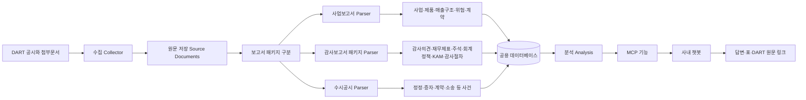
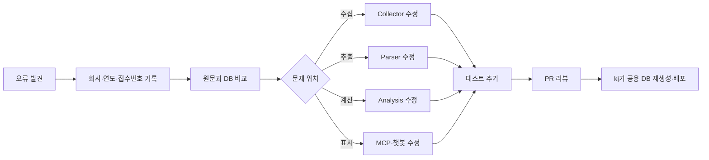

# KReports 전체 구조와 데이터 흐름

## 1. 이 문서에서 답하려는 질문

이 문서는 개발 경험이 많지 않은 팀원이 다음 질문에 답할 수 있도록 합니다.

- KReports는 정확히 무엇을 하는가?
- 사업보고서와 감사보고서 패키지는 어디에서 나뉘는가?
- 재무제표와 주석은 어느 보고서에서 가져오는가?
- 데이터베이스는 누가 관리하고 팀원은 어떻게 사용하는가?
- 사용자의 질문이 어떤 과정을 거쳐 챗봇 답변이 되는가?
- 담당 기능을 고치려면 어느 부분을 확인해야 하는가?

## 2. KReports를 한 문장으로 설명하면

> KReports는 DART의 사업보고서, 감사보고서 패키지와 수시공시를 수집·구조화하고, MCP를 통해 챗봇이 검색·비교·분석 기능을 호출하여 원문 근거와 함께 답하도록 만드는 금융·감사 정보 기반입니다.

## 3. 전체 구조



## 4. 단계별 쉬운 설명

### 4.1 DART

DART는 금융감독원의 공식 전자공시 시스템입니다. KReports의 가장 중요한
원천입니다.

KReports는 보고서 제목만 저장하는 것이 아니라 가능한 경우 다음까지
보존합니다.

- DART 접수번호
- 회사코드
- 사업연도
- 보고서 종류
- 첨부문서
- 원문 XML 또는 HTML
- 원문 해시(Hash, 파일 내용이 같은지 확인하는 고유한 요약값)

### 4.2 Collector

Collector(컬렉터, DART에서 원문과 데이터를 가져오는 수집 코드)는 다음을
수행합니다.

- 회사목록 조회
- 공시목록 조회
- 보고서 및 첨부문서 다운로드
- 재무정보 API 조회
- 수집 성공·실패 기록
- 동일 자료 중복 수집 방지

공용 Collector와 관리용 DB는 `kj`가 실행합니다. `ye`, `ei`는 공용 DB에
직접 쓰지 않습니다.

### 4.3 Source Document

Source Document(소스 문서, 가공하기 전의 DART 원문 또는 그 보관 위치)는
나중에 Parser를 다시 실행하거나 추출 결과를 검증하는 근거입니다.

원문이 크면 데이터베이스 안에 전부 넣지 않고 외부 저장소에 보관하고,
데이터베이스에는 위치와 해시를 저장할 수 있습니다.

### 4.4 Parser

Parser(파서, 원문에서 필요한 표·제목·문단을 찾아 구조화하는 코드)는
보고서 종류에 따라 다릅니다.

#### 사업보고서 Parser

주로 다음을 찾습니다.

- 사업의 내용
- 제품·서비스
- 매출·매입 구조
- 연구개발
- 위험
- 주요 계약
- 종속회사 및 기타 사업 공시

#### 감사보고서 패키지 Parser

주로 다음을 찾습니다.

- 감사의견
- 감사의견 근거
- 감사대상 재무제표
- 재무제표 주석 전체
- 회계정책
- 중요한 회계추정과 판단
- 핵심감사사항
- 핵심감사사항 선정 이유
- 감사절차
- 계속기업·강조사항·기타사항

재무제표 주석은 감사보고서 패키지에서 가져오는 것이 기본입니다.
사업보고서에서 가져온 주석 데이터가 남아 있다면 이관 전의 대체자료로만
취급합니다.

### 4.5 Database

Database(데이터베이스, 정리된 정보를 표 형태로 저장하고 조회하는 공용
자료함)는 하나의 공통 구조를 사용합니다.

대표적인 정보는 다음과 같습니다.

| 데이터 영역 | 쉬운 설명 | 기본 원천 |
|---|---|---|
| 회사 | 회사명·종목코드·DART 회사코드 | DART 회사목록 |
| 공시목록 | 어떤 공시가 언제 제출됐는지 | DART 공시목록 |
| 재무정보 | 매출·이익·자산·현금흐름 등 | 감사대상 재무제표·재무 API |
| 사업 섹션 | 사업 내용·위험·계약 등의 본문 | 사업보고서 |
| 주석 | 재무제표 주석 원문 | 감사보고서 패키지 |
| 회계정책 | 수익인식·리스·금융상품 등 | 감사보고서 패키지 |
| 감사의견 | 적정·한정·부적정·의견거절 | 감사보고서 패키지 |
| KAM | 개별 핵심감사사항 | 감사보고서 패키지 |
| 감사절차 | KAM에 대응한 주요 감사절차 | 감사보고서 패키지 |
| 공시 사건 | 정정·증자·계약·소송 등 | 해당 수시공시 |
| 품질 상태 | 회사·연도별 자료 확보 상태 | 전체 데이터 검증 결과 |

### 4.6 Analysis

Analysis(분석, 저장된 자료를 업무 목적에 맞게 조회·비교·계산하는 과정)는
원문 추출과 구분됩니다.

예:

- 최근 3개년 매출과 이익 추이 계산
- 영업현금흐름과 순이익 비교
- 계속기업 위험요인 점검
- 감사인 변경 이력 정리
- 동종업계 내 회사의 위치 계산
- 회계정책 문구의 연도별 변화 비교
- 기준회사와 Peer 주석 비교

Parser가 원문을 틀리게 나누면 Analysis도 틀립니다. 반대로 원문이 정확해도
Analysis 계산이나 조건이 틀릴 수 있습니다. 따라서 오류를 발견하면 어느
단계의 문제인지 구분해야 합니다.

### 4.7 MCP

MCP(Model Context Protocol, 챗봇이 외부 데이터와 기능을 정해진 방식으로
호출할 수 있게 하는 연결 규격)는 챗봇과 KReports 사이의 표준 연결입니다.

MCP 기능 하나를 Tool(도구, 예: 회사검색·감사의견 조회·Peer 비교)이라고
부릅니다.

챗봇은 데이터베이스에 직접 SQL을 작성하는 대신 KReports가 공개한 Tool을
호출합니다.

```text
사용자: “삼성전자의 최근 감사의견과 KAM을 알려줘.”
→ 챗봇이 회사검색 Tool 호출
→ 감사이력·감사보고서 Tool 호출
→ KReports가 읽기 전용 DB 조회
→ 구조화 결과와 원문 링크 반환
→ 챗봇이 사용자 언어로 정리
```

### 4.8 Chatbot Answer

사용자 답변은 개발자용 로그가 아닙니다. 다음 순서를 지킵니다.

1. 질문에 대한 직접 답변
2. 핵심 수치·문구·회사
3. 필요한 표
4. DART 원문 링크
5. 결론에 영향을 주는 자료 한계
6. 다음 확인사항

사용자 답변에는 DB 표명, 내부 상태코드, 해시, 로컬 경로 등의 개발 정보가
나오지 않아야 합니다.

## 5. 보고서의 경계

### 5.1 사업보고서에서 가져올 것

```text
사업모델
제품·서비스
매출·매입 구조
주요 계약
위험
연구개발
사업상 종속회사 설명
지배구조 및 법정 공시
```

### 5.2 감사보고서 패키지에서 가져올 것

```text
감사인의 감사보고서
감사의견과 근거
감사대상 재무제표
재무제표 주석
회계정책
중요한 추정과 판단
KAM과 선정 이유
감사절차
계속기업·강조·기타사항
```

### 5.3 두 원천을 연결하는 예시

사용자 질문:

> “A사의 매출구조와 수익인식 정책, 매출 KAM 및 감사절차를 연결해서
> 알려줘.”

필요한 자료:

```text
사업보고서
- 제품별·지역별 매출구조
- 주요 고객·계약 정보

감사보고서 패키지
- 수익인식 회계정책
- 매출 관련 재무제표 주석
- 매출 KAM
- KAM 선정 이유
- 감사절차

수시공시
- 주요 공급계약
- 정정공시
```

## 6. 공용 데이터베이스 운영

### 6.1 권한

| 사람 | 공용 DB 읽기 | 공용 DB 쓰기 | 테스트 DB |
|---|---:|---:|---:|
| `kj` | 가능 | 가능 | 가능 |
| `ye` | 가능 | 불가 | 가능 |
| `ei` | 가능 | 불가 | 가능 |

### 6.2 읽기 전용의 의미

`ye`, `ei`는 다음을 할 수 있습니다.

- 모든 주요 데이터 조회
- 분석 코드 작성
- MCP 결과 개선
- Parser 코드 수정안 작성
- 테스트용 DB 생성
- 픽스처 작성
- 실제 DART 원문과 DB 비교
- PR 제출

다음은 하지 않습니다.

- 공용 DB 행을 직접 수정
- 공용 DB에 임의 데이터를 추가
- 공용 DB 마이그레이션 실행
- 운영 DART API Key 사용
- 출시 DB 교체

### 6.3 데이터 오류 처리



## 7. 코드 폴더를 이해하는 최소 기준

| 위치 | 역할 | 비개발자 관점 설명 |
|---|---|---|
| `kreports/collector/` | DART 수집 | 원문을 가져오는 곳 |
| `kreports/processor/` | 문서 파싱 | 표·문단을 나누는 곳 |
| `kreports/db/` | DB 모델·접속 | 자료함의 구조를 정하는 곳 |
| `kreports/analysis/` | 분석 기능 | 조회·비교·계산하는 곳 |
| `kreports/judge/` | 위험 플래그 | 규칙에 따라 위험신호를 계산하는 곳 |
| `kreports/mcp/` | MCP 기능 | 챗봇에 기능을 공개하는 곳 |
| `kreports/conversation/` | 대화 상태 | 다음 5개 등 대화 흐름을 유지하는 곳 |
| `tests/` | 자동 테스트 | 변경이 맞는지 반복 확인하는 곳 |
| `docs/` | 문서 | 업무·기술·배포 기준을 설명하는 곳 |

## 8. 담당자별 E2E 흐름

E2E(End to End, 사용자의 입력부터 최종 답변까지 전체 흐름)는 담당자가
끝까지 이해해야 합니다.

### `ye`의 기본 흐름

```text
사업보고서 본문
→ 사업·매출구조 추출
→ 재무·공시 데이터 결합
→ 사업·재무 분석
→ MCP 결과
→ 사용자 답변
```

### `ei`의 기본 흐름

```text
감사보고서 패키지
→ 첨부 재무제표·주석·KAM 추출
→ 회계정책·감사근거 연결
→ MCP 결과
→ 사용자 답변과 원문 링크
```

### `kj`의 기본 흐름

```text
원문 수집·DB 관리
→ 보고서 원천과 품질 통제
→ 공통 MCP·대화·보안
→ 두 기능 통합
→ 출시 DB와 제출 시연
```

## 9. 기능 변경 전 확인 질문

담당자는 AI에게 코드를 변경하도록 요청하기 전에 다음을 확인합니다.

1. 이 기능의 사용자는 누구인가?
2. 사용자가 어떤 질문을 하는가?
3. 기본 원천 보고서는 무엇인가?
4. 감사보고서 패키지의 첨부문서를 사용해야 하는가?
5. 현재 데이터는 어느 표에 있는가?
6. 기존에 같은 규칙을 구현한 함수가 있는가?
7. 연결·별도와 사업연도를 어떻게 구분하는가?
8. 데이터가 없으면 어떤 결과를 반환해야 하는가?
9. 어떤 실제 공시와 테스트로 검증할 것인가?
10. MCP와 사용자 답변까지 영향을 받는가?

## 10. 기능 완료 기준

- 원천 보고서와 접수번호 확인
- 감사보고서 패키지와 사업보고서 역할 구분
- 공용 DB를 손으로 수정하지 않음
- 기존 코드 재사용 여부 확인
- 자동 테스트 추가 또는 실행
- 실제 DART 원문 대조
- MCP 결과 확인
- 사용자 답변 확인
- 자료 한계 표시
- PR에 검증 결과 기록
