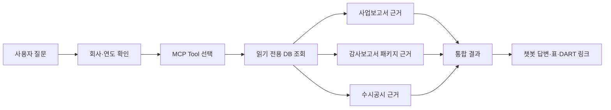

# 2026년 9월 16일 제출자료 제작 계획

## 1. 제출자료

이번 제출물은 두 가지입니다.

1. **아이디어 소개 영상**
   - 권장 60~85초
   - 최대 90초
   - POC 시연, 프로토타입, 화면예시, 프로세스 설계, PPT, 이미지 등 자유 형식
2. **아이디어 상세 설명서**
   - Word 형식
   - 문제 상황 및 아이디어 개요
   - 업무 적용 시나리오 및 구체화 내용
   - 기대효과 및 확산 가능성

영상과 Word 문서는 같은 제품 버전과 같은 사실을 설명해야 합니다.

## 2. 제출 버전 고정

영상과 문서에 다음 정보를 내부 기록으로 남깁니다.

- Git Commit SHA(영상에 사용한 코드의 정확한 버전 식별값)
- Runtime DB 버전(실제 MCP가 읽은 출시 후보 데이터베이스)
- 데이터 기준일
- 시연 회사와 사업연도
- MCP 실행 방식
- 촬영일
- 알려진 데이터 한계

최종 제출 화면에는 기술 식별값을 모두 보여줄 필요는 없지만, 내부적으로는
어떤 코드·DB 결과를 촬영했는지 재현할 수 있어야 합니다.

## 3. 아이디어의 핵심 메시지

### 한 문장

> KReports는 DART의 사업보고서와 감사보고서 패키지를 구조화하고 MCP로
> 챗봇에 연결해, 분산된 사업·재무·주석·감사근거를 원문 출처와 함께 한
> 질문에서 확인하도록 돕는 업무지원 도구입니다.

### 반드시 전달할 세 가지

1. **문제:** 필요한 정보가 사업보고서, 감사보고서 패키지와 수시공시에
   흩어져 있어 사람이 반복 검색·연결·검증해야 함
2. **해결:** DART 원문을 구조화한 읽기 전용 DB와 MCP Tool을 통해 챗봇이
   근거 있는 검색·분석을 실행
3. **효과:** 조사시간 단축, 검토범위 표준화, 원문 재확인, 유사업무 확산

## 4. 영상 구성 원칙

### 목표 길이

- 목표: 80~85초
- 절대 최대: 90초
- 최종 편집본은 여유를 위해 87초 이하 권장

### 화면 구성

단순 발표자 설명보다 다음 조합을 권장합니다.

```text
문제 상황 이미지·PPT
→ KReports 전체 프로세스 그림
→ 실제 챗봇 질문과 결과
→ 사업보고서·감사보고서 패키지 원문 링크
→ 기대효과·확산 가능성
```

### 피할 것

- 코드를 오래 보여주는 장면
- Tool 이름을 나열하는 화면
- 읽을 수 없는 작은 표
- 데이터베이스 구조를 지나치게 상세히 설명
- 검증하지 않은 시간절감률이나 정확도 주장
- 사업보고서 주석을 감사보고서 원문처럼 표현
- 성공 사례만 보여주고 자료 제한을 숨김

## 5. 영상 스토리보드

| 구간 | 시간 | 화면 | 핵심 메시지 |
|---|---:|---|---|
| 1 | 0~10초 | DART 여러 보고서·검색 화면 | 정보는 많지만 여러 제출물에 분산 |
| 2 | 10~20초 | 기존 수작업 프로세스 | 검색·연결·원문 검증을 반복 |
| 3 | 20~31초 | KReports E2E 구조도 | DART → DB → MCP → 챗봇 |
| 4 | 31~42초 | 챗봇에 대표 질문 입력 | 자연어로 업무 질문 |
| 5 | 42~62초 | 매출구조·수익인식 주석·KAM·감사절차 결과 | 두 보고서의 근거를 한 답변으로 연결 |
| 6 | 62~72초 | DART 원문 링크 클릭 | 결과를 원문까지 추적 가능 |
| 7 | 72~82초 | 기대효과 카드 | 시간·품질·협업 개선 |
| 8 | 82~87초 | 확산 영역과 로고 | 감사·회계자문·Deal·CFO로 확산 |

## 6. 영상 대표 질문

> “A사의 사업보고서상 매출구조와 감사보고서 패키지의 수익인식 정책,
> 관련 주석, 매출 핵심감사사항 및 감사절차를 연결해 주요 확인사항을
> 원문 근거와 함께 정리해줘.”

이 질문은 다음 차별점을 한 번에 보여줍니다.

- 사업보고서 본문의 매출구조
- 감사보고서 첨부 재무제표와 주석
- 수익인식 회계정책
- KAM과 선정 이유
- 감사절차
- 원문 접수번호와 DART 링크
- 여러 보고서의 교차 연결

## 7. 영상 내 결과 화면 기준

### 직접 답변

첫 화면에는 결론을 짧게 보여줍니다.

예:

```text
A사는 제품 판매와 장기계약에서 서로 다른 시점에 수익을 인식하고 있으며,
감사인은 매출의 발생과 기간귀속을 핵심감사사항으로 다뤘습니다.
```

이 문장은 실제 해당 회사 원문과 검증된 경우에만 사용합니다.

### 표

| 구분 | 확인 내용 | 기본 원천 |
|---|---|---|
| 사업·매출구조 | 제품·지역·계약별 구조 | 사업보고서 |
| 수익인식 정책 | 통제 이전 시점·기간 인식 등 | 감사보고서 패키지 주석 |
| KAM | 매출 관련 핵심감사사항 | 감사보고서 본문 |
| 감사절차 | 내부통제·표본·Cut-off 등 | 감사보고서 본문 |
| 추가 공시 | 정정·주요계약 | 해당 수시공시 |

### 원문 링크

- `공시 보기`
- `관련 문단`
- `주석 전체`

내부 Resource URI, DB 경로, 해시는 영상에 노출하지 않습니다.

## 8. 영상 내레이션 초안 구조

### 0~20초 — 문제

> “기업을 검토할 때 사업 내용은 사업보고서에, 재무제표와 주석·감사근거는
> 감사보고서 제출물에, 주요 사건은 수시공시에 나뉘어 있습니다. 회계사는
> 회사와 연도를 다시 맞추며 원문을 반복 검색하고 직접 연결해야 합니다.”

### 20~31초 — 아이디어

> “KReports는 DART 자료를 보고서와 원천별로 구조화한 뒤, 읽기 전용
> 데이터베이스와 MCP를 통해 사내 챗봇에 연결합니다.”

### 31~72초 — 구체화 결과

> “사용자가 한 번 질문하면 사업보고서의 매출구조, 감사보고서 패키지에
> 첨부된 수익인식 주석, 관련 핵심감사사항과 감사절차를 함께 확인할 수
> 있습니다. 각 결과는 실제 DART 공시로 다시 이동해 검증할 수 있습니다.”

### 72~87초 — 효과와 확산

> “반복 검색시간을 줄이고 검토범위와 출처 확인을 표준화할 수 있으며,
> 감사계획·수임검토·회계정책 Peer 비교뿐 아니라 Deal과 고객 CFO 공시
> 업무까지 확장할 수 있습니다.”

최종 대본은 실제 측정결과와 구현범위에 맞춰 수정합니다.

## 9. 영상 역할

| 업무 | 담당 |
|---|---|
| 전체 메시지·대본·최종 승인 | `kj` |
| 문제 상황·사업보고서·재무 효과 | `ye` |
| 감사보고서 패키지·주석·KAM 화면 | `ei` |
| 통합 시연 환경·DB·MCP | `kj` |
| 화면 캡처 | 각 담당 기능 담당자 |
| 1차 편집 | `ei` 중심, 전원 협업 |
| 회계적 표현 검토 | `ye` |
| 원천·접수번호·자료한계 검토 | `ei`, `kj` |

## 10. Word 상세 설명서 권장 구조

분량 제한이 없다면 본문 6~8페이지를 권장합니다. 필요한 증거는 부록으로
분리합니다.

```text
표지
1. 문제 상황 및 아이디어 개요
2. 업무 적용 시나리오 및 구체화 내용
3. 기대효과 및 확산 가능성
4. 현재 구현범위와 향후 계획
부록: 구조도·화면·테스트·용어
```

# 10.1 문제 상황 및 아이디어 개요

## A. 해결하고자 하는 업무상 문제

포함할 내용:

- DART 자료가 보고서·첨부문서·연도별로 분산
- 사업보고서와 감사보고서 패키지를 각각 열어야 함
- 감사보고서 첨부 재무제표·주석과 KAM을 사람이 다시 연결
- 회사명·접수번호·사업연도·연결/별도 기준을 반복 확인
- 비교회사 자료를 같은 방식으로 재검색
- 일반 챗봇 답변의 원문 추적 어려움
- 담당자의 숙련도에 따라 검색 범위가 달라짐

## B. 아이디어 개요

포함할 내용:

- KReports 정의
- 보고서 원천 구분
- 읽기 전용 데이터베이스
- MCP 기능
- 챗봇 사용자 경험
- 원문·접수번호·DART 링크
- 자료 미확보·일부 확보 상태 표시

## C. 기존 방식과 제안 방식 비교

| 기존 방식 | KReports 적용 방식 |
|---|---|
| DART에서 각 보고서 수작업 검색 | 회사·연도 기준으로 구조화 검색 |
| 사업·재무·감사정보를 사람이 연결 | MCP Tool이 원천별 결과 조합 |
| 결과를 별도로 복사·정리 | 챗봇이 표와 근거 목록으로 제공 |
| 원문 위치를 다시 찾음 | DART 링크와 관련 문단 제공 |
| 자료 누락 이유를 알기 어려움 | 자료 상태와 한계를 명시 |

### 작성 역할

- `ye`: 현행 업무와 불편, 수작업 프로세스
- `ei`: 감사보고서 패키지·첨부 주석 검토의 불편
- `kj`: 아이디어 개요와 전체 구조

# 10.2 업무 적용 시나리오 및 구체화 내용

## A. 주요 기능

### 회사·사업 이해

- 사업 개요
- 제품과 매출구조
- 위험·R&D·계약
- 최근 재무 추이

### 감사보고서 패키지 분석

- 감사의견
- 감사대상 재무제표
- 주석과 회계정책
- KAM과 선정 이유
- 감사절차
- 계속기업·강조사항

### 비교·위험 분석

- 재무·현금흐름
- Peer 선정과 비교
- 정정·증자·계약·소송 공시
- 회계정책·주석·KAM Peer 비교

### 원문 근거

- 접수번호
- 보고서 종류
- 사업연도
- 연결·별도
- 원문 일부·전체·대체자료 구분
- DART 링크

## B. 업무 활용 흐름



## C. 대표 시나리오

수익인식과 매출 감사 연결 시나리오를 단계별로 설명합니다.

1. 회사 검색
2. 사업보고서 매출구조 확인
3. 감사보고서 패키지 첨부 재무제표·주석 확인
4. 수익인식 회계정책 조회
5. 매출 KAM과 감사절차 조회
6. 정정·주요계약 공시 확인
7. 한 답변으로 조합
8. DART 원문 재확인

## D. 구현 구조

포함할 그림:

- 전체 Architecture(시스템 구성)
- E2E 데이터 흐름
- 보고서별 원천 구분
- MCP Tool 그룹
- 브랜치와 협업 흐름

## E. 구체화 증거

포함할 자료:

- 실제 챗봇 화면
- 사업보고서 결과
- 감사보고서 패키지 결과
- 주석 원문
- KAM·감사절차
- DART 링크
- 자료 일부·미확보 처리
- 자동 테스트 결과
- 대표 회사 검증표

### 작성 역할

- `ye`: 사업보고서·사업/재무 기능과 화면
- `ei`: 감사보고서 패키지·주석·감사근거 기능과 화면
- `kj`: DB·MCP·통합 시나리오와 구조도

# 10.3 기대효과 및 확산 가능성

## A. 기대효과 측정

추정과 실측을 구분합니다.

### 실측할 항목

- 회사 1곳의 사업·수익인식·KAM 조사시간
- 원문 위치를 찾는 시간
- 비교회사 5곳 자료수집 시간
- 결과 중 DART 링크 제공 비율
- 실제 원문과 일치한 항목 비율
- 사용자가 수정한 항목 수
- 같은 질문 반복 시 결과 일관성

### 측정 방식 예시

```text
수작업 방식
- 동일한 질문을 DART에서 직접 조사
- 시작·종료시간 기록
- 찾은 원문과 항목 기록

KReports 방식
- 같은 회사·연도·질문 사용
- 시작·종료시간 기록
- 결과와 원문 검증

비교
- 시간
- 누락 항목
- 출처 확인 가능 여부
- 수정 필요사항
```

검증표본이 적으면 “평균 70% 단축”처럼 일반화하지 않고 “시연 표본에서
A분에서 B분으로 감소”라고 표현합니다.

## B. 예상 업무 개선 효과

### 시간

- 보고서와 첨부문서 탐색시간 감소
- 회사·연도·주석·KAM 연결시간 감소
- Peer 반복 검색시간 감소
- 원문 재탐색시간 감소

### 품질

- 검토범위 표준화
- 보고서 원천 혼동 감소
- 연결·별도·연도 확인
- 원문 근거와 제한 표시
- 누락자료와 미공시 구분

### 협업·교육

- 동일 출처를 리뷰어와 공유
- 조사결과 재사용
- 주니어의 보고서 구조 학습
- 선배의 반복 설명 부담 감소
- AI 빌딩과 GitHub 협업 경험 축적

## C. 확산 가능성

| 영역 | 활용 예시 |
|---|---|
| 외부감사 | 감사계획, 수임·유지, KAM·계속기업 검토 |
| 회계자문 | 회계정책·주석 Peer 비교, 공시 개선 |
| Deal | 재무·현금흐름·공시사건 1차 조사 |
| 세무·리스크 | 사업·관계회사·공시 구조 파악 |
| 고객 CFO | 결산·공시 전 유사업종 사례 검색 |
| 품질관리 | 정정·감사의견·감사인 변경 모니터링 |
| 교육 | 신입 회계사의 DART·감사보고서 학습 |

## D. 기술적 확산

- 다른 공공데이터 MCP 연결
- 내부 지식·감사방법론과 결합
- 회사별 정기 모니터링
- 다른 보고서·업종·국가 공시 확장
- 사내 업무 Agent의 근거 데이터 계층으로 활용

### 작성 역할

- `ye`: 시간·업무품질·감사 활용효과
- `ei`: 주니어 학습·감사근거 검토효과
- `kj`: 타 본부·제품·기술 확산

## 11. 현재 구현과 향후 계획 구분

설명서는 다음을 구분해야 합니다.

| 구분 | 의미 |
|---|---|
| 구현 완료 | 현재 코드·DB·MCP에서 반복 검증됨 |
| MVP 조건부 | 특정 회사·연도·데이터 범위에서 사용 가능 |
| 개발 중 | 코드 또는 데이터 이관 진행 중 |
| 향후 계획 | 아직 구현되지 않은 확장 방향 |

특히 사업보고서 기반 재무제표 주석을 감사보고서 패키지로 이관하는 범위는
완료 여부와 남은 커버리지를 정직하게 적습니다.

## 12. 제출 전 체크리스트

### 영상

- [ ] 90초 이하
- [ ] 음성·자막 식별 가능
- [ ] 문제·아이디어·구체화·효과 포함
- [ ] 실제 동작 화면 포함
- [ ] 사업보고서와 감사보고서 패키지 원천 구분
- [ ] DART 원문 링크 확인
- [ ] 기밀정보·API Key·내부 경로 미노출
- [ ] 영상 결과와 실제 Release 버전 일치

### Word

- [ ] 세 개 필수 항목 제목 사용
- [ ] 업무상 문제 구체적 설명
- [ ] 아이디어 핵심과 구조도
- [ ] 업무 적용 흐름
- [ ] 실제 구체화 화면
- [ ] 기대효과의 근거
- [ ] 확산 가능성
- [ ] 구현완료·조건부·향후계획 구분
- [ ] 원천과 자료한계 기재
- [ ] 오탈자·페이지·그림 확인

### 파일·제출

- [ ] 영상 재생 확인
- [ ] Word 열림 확인
- [ ] 파일명 통일
- [ ] 최종본 별도 보관
- [ ] 9월 15일 내부 완료
- [ ] 9월 16일 공식 업로드와 완료 화면 확인
